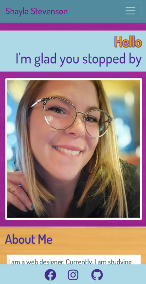
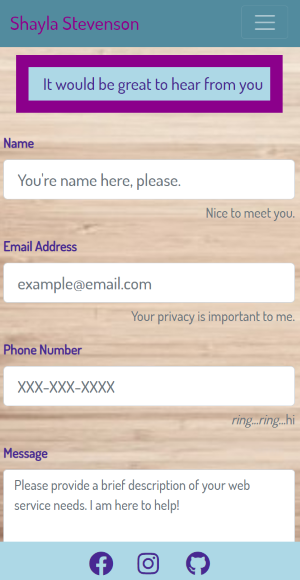
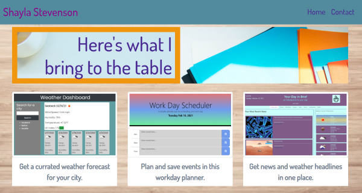

# Shayla Stevenson 
## Personal Portfolio
# 

### Table of Contents

- [Introduction](#introduction)
- [Features](#features)
- [Images](#images)
- [Notes](#notes)
- [Resources](#resources)
- [Links](#links)
# 

## Introduction
Get to know me! My personal portfolio page features my story as a developer, portfolio, and a way to get in touch. My hope is that you will have a sense of my design aesthetic and abilities when viewing the application. Enjoy!

## Features
* Mobile first design
* Bootstrap 4 responsive grid system
* Easy navigation by use of internal and external links
* Dynamic experience when inputting contact information

## Images

## Notes
This application is an updated version of my original portfolio page. The following improvements were made to this version:
* Made use of Bootstrap's jumbotron on the homepage
* Made more effective use of CSS styling and utility classes
* Removed unnecessary HTML
* Added a JavaScript file to handle contact information
* Added additional project to portfolio page and adjusted layout

## Technologies
* HTML
* CSS
* Bootstrap 4
* JavaScript
* JQuery
* Font Awesome
* Google Fonts

## Resources
* Bootstrap documents
* JQuery documents
* StackOverflow
* MDN
* W3School
* GeeksforGeeks
* Font Awesome
* Google Fonts
 
## Links
* Visit my personal website @ https://shaylastevenson.github.io/shayla-stevenson-portfolio/

* View my Github profile @ https://github.com/ShaylaStevenson 

## Contact Me
* Linkedin: https://www.linkedin.com/in/shayla-stevenson-806143200/

* Email: shayla.rose.stevenson@gmail.com